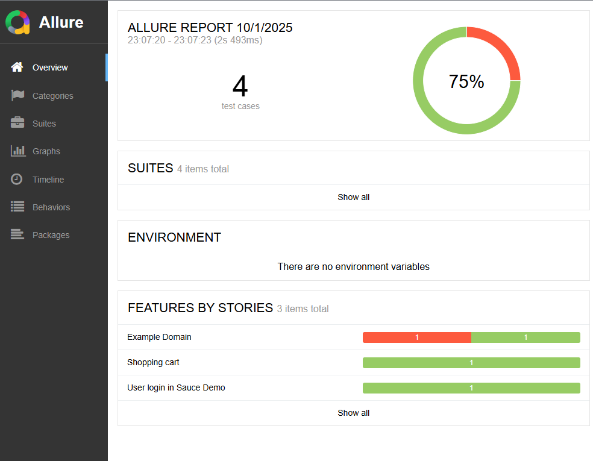
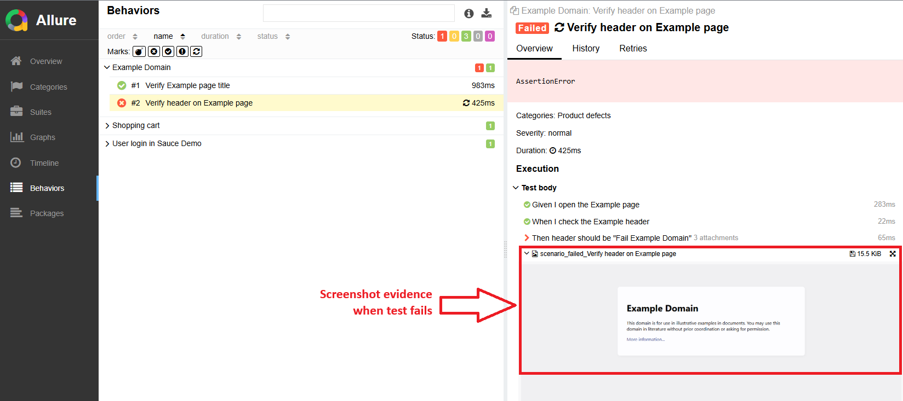

# QA Automation Framework – Python + Behave

[](https://petudeveloper.github.io/QA-Automation-Framework/)


## 🌟 Overview
This is a **Python-based QA Automation Framework** designed for **web application testing** using **Behave (BDD)** and **Selenium WebDriver**.  
It follows a **Page Object Model (POM)** structure for maintainable and scalable tests, and integrates **Allure reports** for clear test reporting.

---

## 🧱 Features
- Behavior-Driven Development (BDD) with **Behave**.
- Page Object Model (POM) structure for all pages.
- Selenium WebDriver with automatic **ChromeDriver management**.
- Environment configuration using `.env` files.
- Allure reporting with screenshots on failure.
- Ready for local execution or CI/CD pipelines (Docker, GitHub Actions).
- Configurable headless mode for browser automation.

---

## 📂 Project Structure
```text
Project Structure
├── README.md
├── requirements.txt
├── behave.ini
├── features/
│   ├── *.feature        # Gherkin scenarios
│   ├── steps/           # Step definitions
│   └── environment.py   # Hooks for setup/teardown
├── src/
│   └── pages/           # Page Object Models
├── utils/
│   └── helpers.py       # Utility functions
├── reports/             # Allure test reports
├── .github/
│   └── workflows/       # CI/CD pipelines
└── docker/
    └── Dockerfile
```
---

## ⚡ Installation

### 1. **Clone the repository:**
```bash
git clone https://github.com/petudeveloper/QA-Automation-Framework.git
cd QA-Automation-Framework
```

### 2. **Create a virtual environment and activate it:**
```bash
python -m venv venv
source venv/bin/activate  # Linux/macOS
venv\Scripts\activate     # Windows
```

### 3. **Install dependencies:**
```bash
pip install -r requirements.txt
```

### 4. **Create a .env file with configuration variables:**
BASE_URL=https://example.com
HEADLESS=true

## 🚀 How to Run Tests
### Run all features:
```bash
behave
```

### Run with Allure reporting:
```bash
behave -f allure_behave.formatter:AllureFormatter -o reports/allure
allure serve reports/allure
```

### Run a specific feature:
```bash
behave features/home.feature
```

---

## 🧩 Adding New Tests

1. Add a new .feature file under features/.
2. Add corresponding step definitions in features/steps/.
3. Create or update Page Objects in src/pages/ if needed.
4. Use utils/helpers.py for reusable functions (e.g., screenshots, API calls).

---

## 🛠️ Best Practices

- Use Given-When-Then for BDD scenarios.
- Keep Page Objects single responsibility: one class per page.
- Use .env for all configurable parameters.
- Include screenshots on failure to help debugging.

---

## 📈 CI/CD Integration

- This project includes a **CI/CD pipeline** using **GitHub Actions**.  
- The pipeline is automatically triggered on every **push** or **pull request** to the `main` branch.

### 🔗 Live Allure Report
👉 [View the latest Allure Report](https://petudeveloper.github.io/QA-Automation-Framework/)

### What the pipeline does
- ✅ Sets up Python and installs dependencies.  
- ✅ Runs Behave tests with **Allure** integration.  
- ✅ Uploads raw Allure results (`reports/allure`) as artifacts.  
- ✅ Generates the **Allure HTML report**.  
- ✅ Publishes the HTML report automatically to **GitHub Pages**.

---

## 📊 Allure Reports Integration

This framework integrates with **Allure** for rich test reporting.

### 1. Configuration
The integration is handled via `behave.ini`:

```ini
[behave]
format = allure_behave.formatter:AllureFormatter
outfiles = reports/allure
```

- `format` → runs the Allure formatter.  
- `outfiles = reports/allure` → saves Allure raw results into this folder.  

### 2. Running tests with Allure
Run your tests as usual:

```bash
behave
```

The results will be stored in `reports/allure`.

### 3. Viewing the report
To view the Allure report locally you need **Allure CLI**:

- **macOS (Homebrew):**
  ```bash
  brew install allure
  ```
- **Windows (Scoop or Chocolatey):**
  ```powershell
  scoop install allure
  # or
  choco install allure
  ```
- **Linux (Debian/Ubuntu):**
  ```bash
  sudo apt-get install allure
  # or download from GitHub releases
  ```

Then run:

```bash
allure serve reports/allure
```

This will open the **interactive Allure dashboard** in your browser.

---

### Example Allure Report

**Allure Overview:**


**Failed Scenario with Screenshot:**


---

## 🔄 CI/CD Integration (GitHub Actions)

This project includes a **CI/CD pipeline** using **GitHub Actions**.  
The pipeline is automatically triggered on every **push** or **pull request** to the `main` branch.

### 1. What the pipeline does
- ✅ Sets up Python and installs dependencies.  
- ✅ Runs Behave tests with **Allure** integration.  
- ✅ Uploads raw Allure results (`reports/allure`) as artifacts.  
- ✅ Generates the **Allure HTML report**.  
- ✅ Publishes the HTML report automatically to **GitHub Pages**.

### 2. Workflow file
The configuration is defined in:  
```
.github/workflows/ci.yml
```

### 3. Example workflow run
On every push/PR to `main`:
```bash
# 1. Install dependencies
pip install -r requirements.txt

# 2. Run Behave with Allure
behave

# 3. Generate report
allure generate reports/allure -o reports/allure-report --clean
```

### 4. Accessing reports
After the workflow completes, you can:
- Download the **Allure raw results** as artifacts.  
- Access the **interactive Allure report** published on **GitHub Pages**:  
  ```
  https://<your-username>.github.io/<your-repo>/
  ```

> ℹ️ Note: You must enable **GitHub Pages** in your repository settings, with `gh-pages` as the source branch.

📌 With this CI/CD integration, the framework ensures **continuous testing**, **reporting visibility**, and a **professional workflow** ready for team collaboration.

---

## 📌 Notes

- Recommended Python version: 3.11+
- Browser: Google Chrome
- Headless mode is enabled by default in CI/CD environments.

---

## 💡 Skills Demonstrated
This project highlights a wide range of QA Automation and Software Engineering skills:
- Behavior-Driven Development (BDD) with Behave and Gherkin syntax (Given-When-Then scenarios).
- Test Automation for Web UI using Selenium WebDriver and the Page Object Model (POM) pattern.
- Python development best practices: clean structure, reusable classes, environment configuration with .env.
- Allure Reports integration: rich test reporting with screenshots, page source, and URLs attached on failures.
- Error handling and debugging: evidence hooks in environment.py for failed steps.
- Cross-platform compatibility: works locally, in Docker, and ready for CI/CD (GitHub Actions).
- Code quality tooling: linting and formatting with Flake8, Black, and isort.
- Version control best practices: feature branches, pull requests, and clear commit messages.
- Scalability in testing: prepared for integration with SauceLabs for cloud-based execution.

---

## 📫 Contact
Created by [petudeveloper](https://github.com/petudeveloper)

